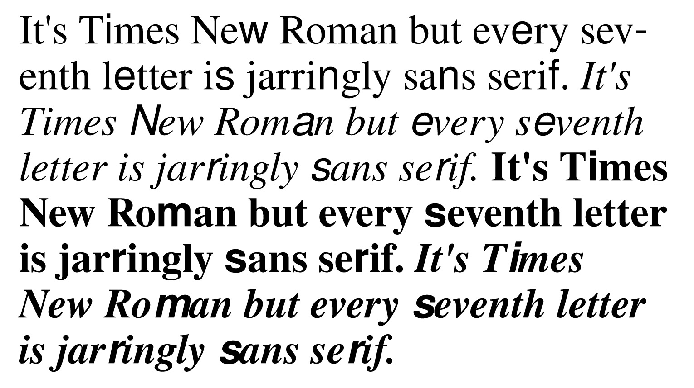
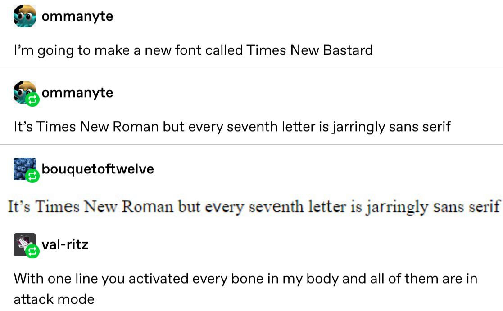

## [Download Times New Bastard](https://github.com/weiweihuanghuang/Times-New-Bastard/releases/download/v1.0/TimesNewBastardv1.0.zip)



It's Times New Roman but every seventh letter is jarringly sans serif. 
Original idea by [ommanyte](https://bouquetoftwelve.tumblr.com/post/186272155342/ommanyte-ommanyte-im-going-to-make-a-new) on Tumblr:



Times New Bastard is a modified version of Nimbus Roman No. 9 L and Nimbus Sans, original source [here](https://git.ghostscript.com/?p=urw-core35-fonts.git;a=summary).

## Using it on the Web
Turn on ligatures and `optimiseLegibility`:

```
font-feature-settings: "kern" on, "liga" on;
text-rendering: optimizeLegibility;
```

## Using it in Microsoft Office
[Turn on Ligatures](https://support.office.com/en-us/article/turn-on-ligatures-or-joined-characters-a1d144fc-759f-4726-a22a-c5686f128a69).

## License

The font and related files in this directory are distributed under the
GNU AFFERO GENERAL PUBLIC LICENSE Version 3 (see the file COPYING), with
the following exemption:

As a special exception, permission is granted to include these font
programs in a Postscript or PDF file that consists of a document that
contains text to be displayed or printed using this font, regardless
of the conditions or license applying to the document itself.
